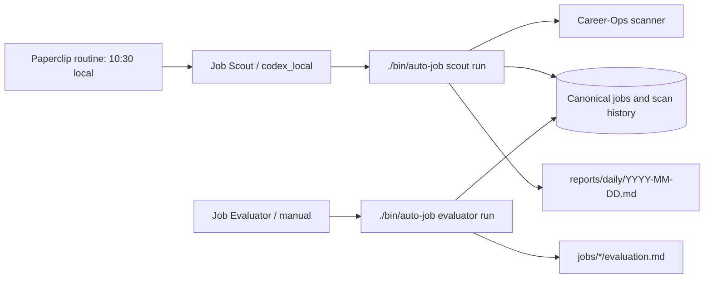

# Paperclip orchestration

Paperclip is an optional local control plane for timing, task ownership, and run history. Auto-job remains the canonical system for companies, postings, profile facts, eligibility, evidence, and application materials.



## Installation and authentication

The supported Paperclip release at the time this integration was written is the current upstream release at commit `d3e0f0a238ed66a05d50ab6f627eb55874f0f57e`. The documented quick start is `npx paperclipai onboard --yes`, followed by `npx paperclipai run`. The local UI/API is normally `http://localhost:3100`.

The agents use Paperclip’s `codex_local` adapter. It runs the local Codex CLI in this repository and uses the host Codex login (`~/.codex/auth.json`, or `$CODEX_HOME/auth.json`); no `OPENAI_API_KEY` is required. The setup scripts only check that the file exists and never print or copy its contents.

Run:

```sh
./orchestration/paperclip/bootstrap.sh --check
./orchestration/paperclip/bootstrap.sh --onboard
./orchestration/paperclip/configure.sh        # safe dry run
PAPERCLIP_API_KEY=... ./orchestration/paperclip/configure.sh --apply
```

`configure.sh --apply` talks to the documented local REST API, creates missing objects by name, and does not recreate an existing topology. Set `PAPERCLIP_API_URL` for a non-default local URL and `AUTO_JOB_TIMEZONE` to an IANA timezone when the machine’s local timezone cannot be inferred.

## Agents and routine

`Job Scout` runs `./bin/auto-job scout run`, which delegates source access to the pinned Career-Ops submodule and writes `reports/daily/YYYY-MM-DD.md`. It may discover, normalize, deduplicate, classify, analyze, store, and summarize. It never applies, sends messages, changes facts, or edits materials.

`Job Evaluator` is persistent but manual by default. Run `./bin/auto-job evaluator run` after selecting saved job records. It maps requirements to verified evidence and assigns Priority A/B/C through the existing auto-job modules.

The Scout routine is `30 10 * * *` (10:30 AM) in the configured local timezone. It uses `coalesce_if_active` and `skip_missed`: an overlapping run coalesces, and a laptop that was asleep does not replay a backlog. Change the schedule in `config/paperclip.yml`, then rerun `configure.sh --apply`.

## Manual operation and failure handling

```sh
./bin/auto-job orchestration status
./bin/auto-job scout run
./bin/auto-job scout last
./bin/auto-job evaluator run
./bin/auto-job paperclip open
```

A completed scan with zero new postings is reported as **No new matches**. A non-zero scanner result or all-source failure is reported as **Search infrastructure failure** so it cannot be mistaken for a quiet market. Reports are compact and idempotent by date; generated personal reports are ignored by Git. Direct `scan`, `evaluate`, `prepare`, and `verify` commands continue to work when Paperclip is stopped or absent.

Pause or resume the routine from the Paperclip dashboard, or use its routine PATCH API with `{"status":"paused"}` / `{"status":"active"}`. Stop the local server with Ctrl-C. Paperclip’s local schedule cannot run while the laptop is off.

## Privacy and telemetry

The current Paperclip CLI documents anonymous telemetry as enabled by default and provides `PAPERCLIP_TELEMETRY_DISABLED=1`, `DO_NOT_TRACK=1`, or `telemetry.enabled: false` to disable it. The launcher exports `PAPERCLIP_TELEMETRY_DISABLED=1` and does not send job content to a separate service. Paperclip run history is orchestration metadata; daily reports and job records remain local auto-job data.

## Removal

Stop Paperclip, remove the Paperclip company/project from its local dashboard if desired, and delete `orchestration/paperclip/` plus `config/paperclip.yml`. No auto-job command depends on Paperclip, so direct scanning and evaluation remain available.
